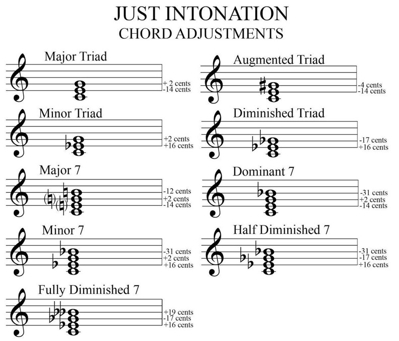
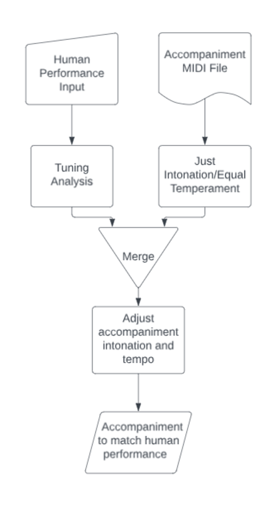

# Tufts-Capstone-Project
**Gavin Grooms**

**Fall 2023 - May 2024**

**Tufts University**

## What is it?
My project will allow a user to produce a computer accompaniment that can match the intonation of the player. It will adjust the intonation of the other notes in each chord based on the input from the performer using Just Intonation (pictured below) or the standard Equal Temperament depending on user preference.

## Who would want to use this?
In the music industry, students and individuals looking to make personal recordings for auditions or other endeavors must either hire an accompanist, fit their tuning and style to computerized recordings, or play without accompaniment.
Authentic, well-tuned accompaniment is expensive, whether that’s through a human accompanist or advanced computer tuning. 
A pianist can cost around $60/hour for human accompaniment. 
Auto-tune software usually involves tuning the human user and not the accompaniment, leading to an inauthentic performance.
Playing with a recording forces a performer to lose their individual interpretation of a piece.

## How does it work?
A user would provide a MIDI file of the accompaniment and a recording of their own part as input and should decide to either use Equal Temperament or Just Intonation.
Analysis of their recording is performed to decide adjustments to accompaniment.
Program outputs a recording of the accompaniment with adjustments made to the tuning to match the human performer.

## Timeline
I expect to complete this project by May 2024 for submission and completion of my Master's degree, however I may continue to supplement this with new features as I see fit in the future. I plan to implement this project by completing any number of phases shown below that mark distinct and important features that I envision this project to have. 

### Phase 1
Build a synthesizer that can automatically tune chords in natural tuning based on manual input. 

### Phase 2
Allow a user to modify the tuning of the base note in a chord manually within 15-20 cents of equal temperament pitch in 440hz and have the program automatically adjust tuning of the other notes in the chord to match the new base note. 

### Phase 3
Use a tuner app or build one to analyze notes in an inputted recording to find average intonation for each note played. Output should be the intonation of each note played in the human input.

### Phase 4
Link the output of phase 3 to the input of phase 2. The intonation from the recording should determine the base note tuning in the app with all other notes adjusting automatically. This should have an allowance of 15-20 cents (subject to change) to prevent totally out of tune chords. 

### Phase 5
Automatically adjust the lengths of notes in the accompaniment to match the tempo of the human player. Produce a finalized .mp3 or .wav file of the original human input with the computer generated and tuned accompaniment all in one. 

### Beyond?
If I get this far, I'll look for lots of user input from friends, family, and others to automate and improve this project as much as possible. I plan for this to start as a capstone project for university, but after that, who knows?